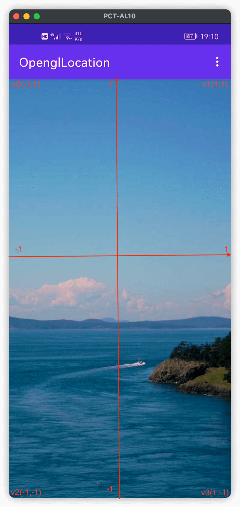
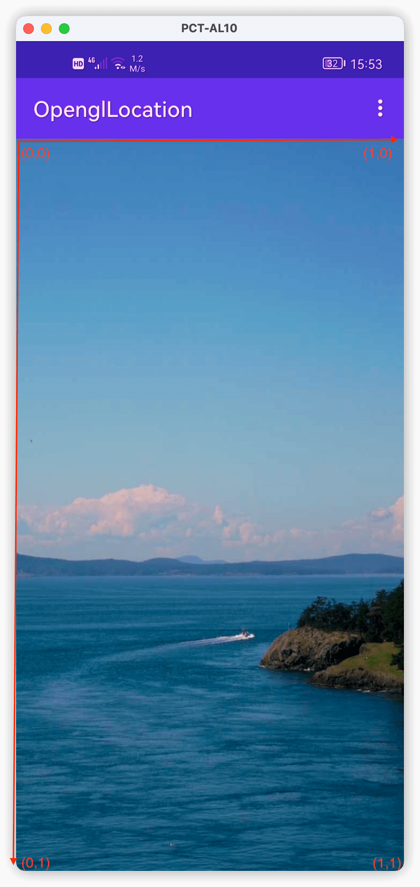

## 项目简介

使用OpenCV显示一张图片，并通过调整纹理坐标系和顶点坐标之间的映射关系来实现图片的旋转、翻转和裁剪。

希望通过本项目你可以对OpenGL中的纹理坐标系和世界坐标系有更深的了解。

### 项目相关知识

在OpenGL中，绘制一个矩形或者多边形是通过绘制多个三角形来达成的，因为在三维坐标系（x,y,z)中，三个顶点可以确定一个平面。 

### 1.世界坐标系

### 2.纹理坐标系

### 项目部分演示

  
 